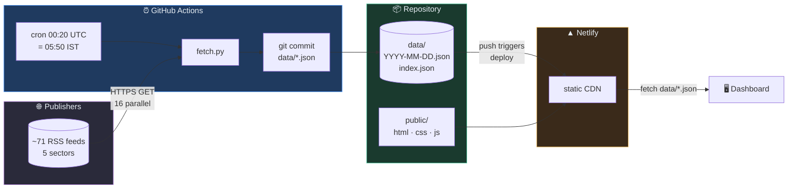
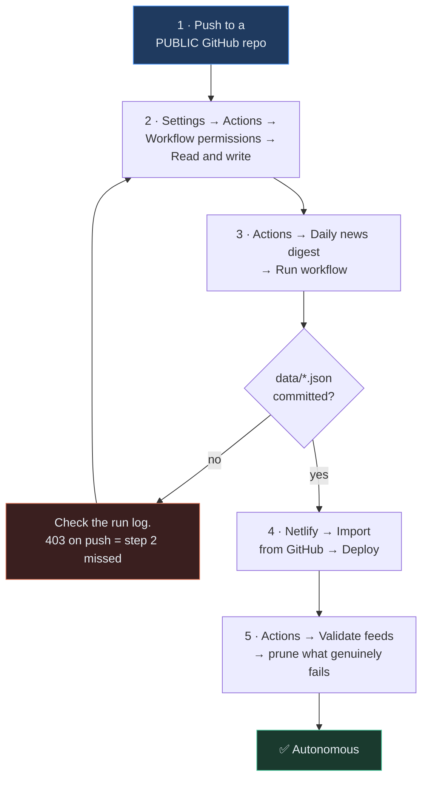
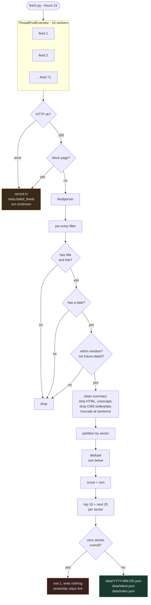
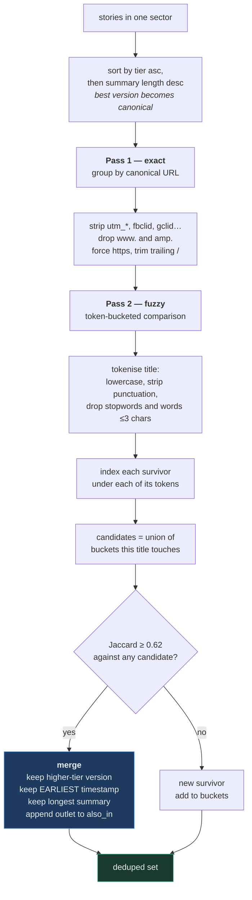
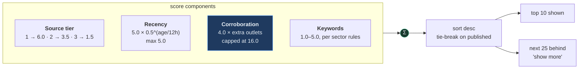
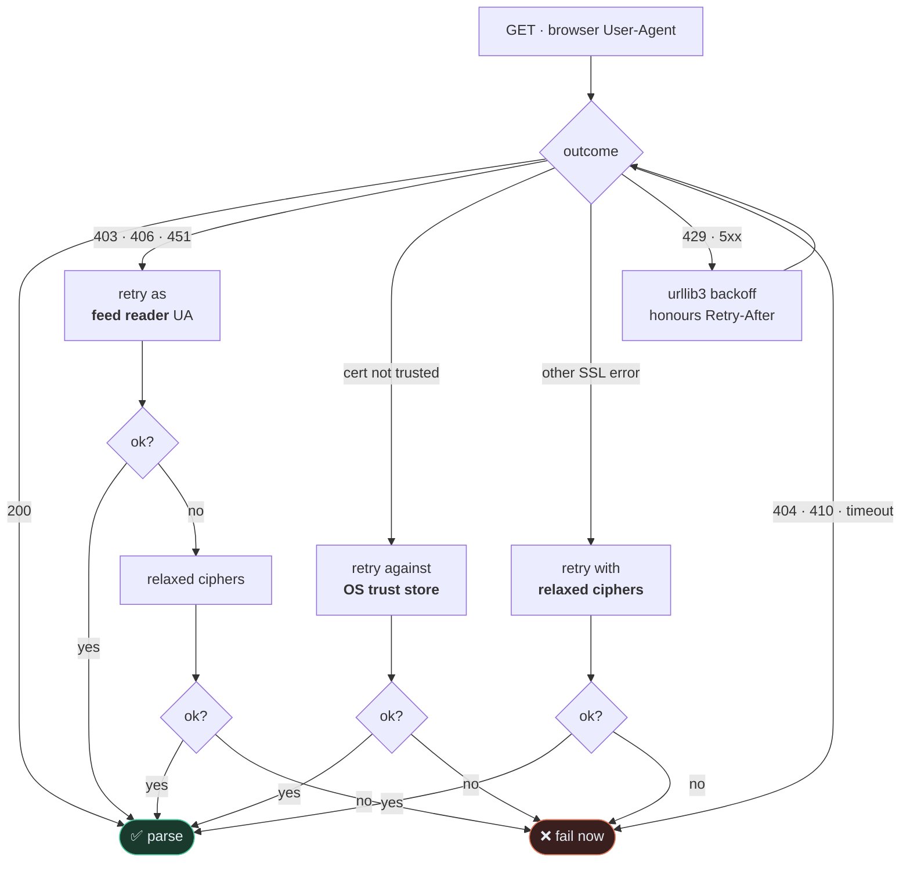
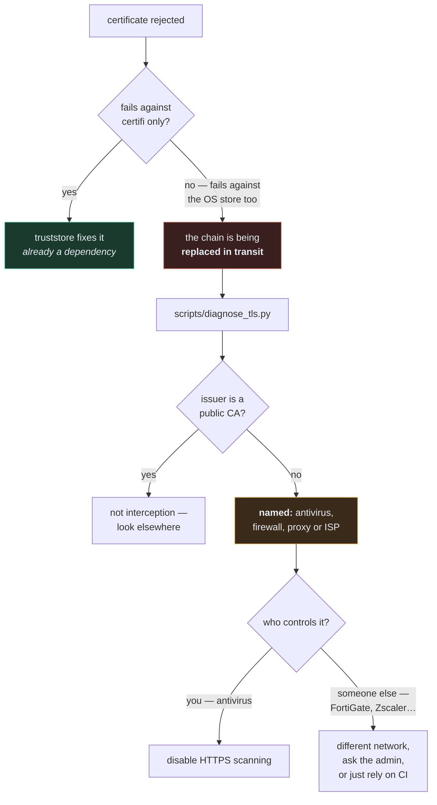

# Daily Digest

A five-sector daily news digest. A scheduled GitHub Action pulls ~71 public RSS
feeds at 05:50 IST, collapses the same story across outlets, ranks what survives,
and commits a JSON file. Netlify redeploys a static dashboard on that commit.

No server, no database, no API keys, no paid tier. Total running cost: zero.

**Sectors** — AI & Tech · Finance & Markets · Geopolitics & Defense ·
Startups, Science & Energy · Entertainment (Marvel/DC weighted)

---

## Table of contents

- [Architecture](#architecture)
- [Setup](#setup)
- [The pipeline](#the-pipeline)
- [Deduplication](#deduplication)
- [Ranking](#ranking)
- [Fetching against hostile networks](#fetching-against-hostile-networks)
- [TLS interception](#tls-interception)
- [Data contract](#data-contract)
- [Operations](#operations)
- [Design decisions](#design-decisions)
- [Extending it](#extending-it)

---

## Architecture

Three moving parts, each of which can fail without taking the others down.



**Why static.** The dashboard reads a JSON file the build already produced. There
is no runtime dependency on anything — no database to go down, no API to rate
limit, no cold start. If the build fails, yesterday's page is still being served.

**Where a run happens.** Entirely inside one GitHub Actions job. The repository
is the database; git history is the backup.

---

## Setup

Five steps, roughly ten minutes.



```bash
git add . && git commit -m "initial commit"
git remote add origin git@github.com:<you>/news-digest.git
git push -u origin main
```

Make the repo **public** — public repos get unlimited Actions minutes, private
ones draw down your 2,000/month free allowance.

Step 2 is the one people miss. Without write permission the fetch succeeds and
the push fails with a 403, so the run goes red having done all the work.

Netlify reads `netlify.toml`, so build command and publish directory are already
configured. Nothing to fill in.

---

## The pipeline



Two guards worth calling out.

**A dead feed never fails the run.** It is recorded in `meta.failed_feeds` and
skipped. Losing one source should not cost you the other seventy.

**An empty digest is never written.** If a run collects zero stories — network
partition, DNS failure, a bad edit to `feeds.py` — it exits non-zero *before*
touching `data/`. The previous day's file stays on disk and the site keeps
serving it. Failing loudly while degrading gracefully.

---

## Deduplication

Ten outlets carrying the same Reuters story should appear once, not ten times.
But near-identical headlines are not string-equal, so this runs in two passes.



**On complexity.** The naive version compares every story against every other —
O(n²), and with ~800 stories a day that is 320,000 comparisons. Bucketing titles
by token means a story is only compared against others sharing at least one
meaningful word, which in practice is a handful. Same results, roughly linear.

**On the merge rules.** Keeping the *earliest* timestamp is deliberate: that is
when the story broke, not when the fifth outlet got around to it. Keeping the
highest-tier version means you get Reuters' wording rather than an aggregator's.
Every other outlet lands in `also_in`, which is what renders as "Also covered by…"
on the card — and feeds straight back into ranking.

**Tuning.** `title_threshold` (0.62) in `rank.py`. Raise it if distinct stories
are being merged; lower it if near-duplicates slip through.

---

## Ranking

Every story gets a score; highest first within its sector.



| Signal | Weight | Rationale |
|---|---:|---|
| Source tier | 6.0 / 3.5 / 1.5 | wires and primary sources over aggregators. 14 feeds are tier 1, 32 tier 2, 25 tier 3 |
| Recency | ≤ 5.0, 12h half-life | a 12-hour-old story scores half a fresh one |
| Corroboration | 4.0 per extra outlet, cap 16.0 | **weighted heaviest on purpose** |
| Keywords | 1.0–5.0 | 23 sector-specific rules; Marvel/DC score 5.0 in Entertainment |

**Why corroboration dominates.** Without a language model in the loop, the
strongest available evidence that a story matters is that many independent
newsrooms independently decided to run it. Eleven outlets covering the same
Superman story is a far better signal than any keyword list. The cap exists so a
single viral item cannot bury everything else.

**If you dislike that behaviour** — say it crowds out good single-source
reporting — lower `CORROBORATION_BONUS` in `rank.py`. All the knobs sit at the
top of that file, deliberately.

---

## Fetching against hostile networks

Publishers and middleboxes break naive feed fetchers in several distinct ways,
and each needs a *different* answer. `http_client.py` reads the first error and
tries only the fallbacks that could plausibly fix that specific error.



| Error | Fallback | Why that one |
|---|---|---|
| `403` `406` `451` | feed-reader User-Agent | a UA containing `python-requests` is the most widely blocked signature there is; many publishers block generic clients on `/feed/` but explicitly allow Feedly |
| untrusted certificate | OS trust store, **once** | a *trust* problem — no User-Agent or cipher list can make an untrusted chain trusted |
| other SSL errors | relaxed ciphers, **once** | a *handshake* problem — some servers negotiate in ways OpenSSL 3 refuses by default |
| `429` `5xx` | exponential backoff | transient; honours `Retry-After` |
| `404` `410` timeout | none — fail immediately | a missing feed will not appear under a different User-Agent |

**Three things make this fast rather than slow.** Retrying a certificate failure
through every rung originally cost ~40 seconds per feed:

1. `connect=0` on the retry policy. urllib3 classifies a TLS failure as a
   connection error and would otherwise retry it three times with backoff.
2. Error-directed routing — a cert failure never tries cipher relaxation,
   because ciphers cannot fix trust.
3. **Never varying the User-Agent on a TLS failure.** The User-Agent is sent
   *after* the handshake completes, so it cannot possibly influence one. Those
   attempts were pure latency on a hopeless case.

Result: ~40s → ~1s per failing feed.

**Verification is never disabled.** Certificate and hostname checking stay on at
every rung. The OS-trust path changes *which* CAs are trusted, never *whether*
trust is checked. Feeds rescued by a fallback are recorded in
`meta.fallback_strategies`, so fragile sources are visible.

---

## TLS interception

Symptom: a group of related sites fail with a certificate error, your browser
opens them fine, and CI has no trouble at all.

```
SSLCertVerificationError('A certificate chain processed, but terminated in a
root certificate which is not trusted by the trust provider.')
```

Trust backends word the same failure differently. OpenSSL (what `certifi` uses)
says *unable to get local issuer certificate*; Windows CryptoAPI says
*terminated in a root certificate which is not trusted*. Either way the chain is
well-formed — the question is **who signed it**.



```bash
uv add cryptography          # optional, for exact issuer names
uv run python scripts/diagnose_tls.py
```

It reads the certificate actually presented by failing hosts, compares against a
control group of working hosts, and prints the issuer. Real output from a
FortiGate 60F doing category-based inspection:

```
Hosts that failed validation
  MITM www.cbr.com          3401B  issued by Fortinet (FGT60FTK22099U2H)
  MITM screenrant.com       3455B  issued by Fortinet (FGT60FTK22099U2H)
Hosts that validated fine (control group)
  ok   www.bbc.co.uk        2042B  issued by GlobalSign nv-sa
  ok   variety.com           923B  issued by Let's Encrypt (YE1)
```

One appliance signing every failing host while the control group gets normal
public CAs. Note the certificate sizes: five unrelated publishers within 54 bytes
of each other is one issuer working from one template.

**Importing the appliance's root CA is not a fix.** It silences the certificate
error, but if the appliance is *blocking* rather than merely inspecting, you then
receive its block page over a nicely trusted connection — HTTP 200, HTML body,
zero entries. `looks_like_block_page()` catches those before feedparser sees
them and reports `blocked by a network filter (not the publisher)`, so a censored
source is never mistaken for a quiet news day.

**There is deliberately no `--insecure` flag**, for exactly that reason.

None of this affects production. GitHub-hosted runners are not behind your
network's middleboxes.

---

## Data contract

One file per day, plus an index. The dashboard reads nothing else.

```
data/
├── index.json          { updated, latest, dates[] }   ← date picker
├── latest.json         copy of the newest digest       ← fast first paint
└── YYYY-MM-DD.json     the digest                      ← permanent archive
```

```jsonc
{
  "date": "2026-08-06",
  "generated_at": "2026-08-06T05:52:11+05:30",   // IST
  "window_hours": 24,
  "sectors": [
    {
      "id": "entertainment",
      "name": "Entertainment",
      "blurb": "Film, television and the comic-book universes",
      "count": 47,                    // unique stories after dedupe
      "top":  [ /* 10 Story objects */ ],
      "more": [ /* next 25 */ ]
    }
  ],
  "meta": {
    "feeds_total": 71,
    "feeds_ok": 56,
    "failed_feeds": [ { "feed": "CBR", "error": "SSL: untrusted certificate" } ],
    "items_fetched": 812,             // before dedupe
    "items_published": 174,
    "per_feed": { "BBC World": 38 },
    "fallback_strategies": { "Business Standard": "legacy-tls" }
  }
}
```

**Story object:**

```jsonc
{
  "title": "Marvel Studios sets release date for new Avengers film",
  "url": "https://variety.com/...",           // as published, for the link
  "canonical_url": "https://variety.com/...", // normalised, for dedupe
  "source": "Variety",
  "feed": "Variety",                          // differs when via Google News
  "tier": 2,
  "sector": "entertainment",
  "author": "Staff Reporter",
  "published": "2026-08-06T04:12:00+00:00",   // UTC, earliest seen
  "summary": "…",                             // publisher's own, ≤420 chars
  "also_in": ["ScreenRant", "CBR"],           // other outlets, from dedupe
  "corroboration": 3,                         // 1 + len(also_in)
  "tags": ["Marvel"],
  "score": 29.07
}
```

Fields prefixed `_` are internal and stripped before serialisation — asserted in
the test suite.

---

## Operations

### Running locally

```bash
uv add -r requirements.txt                      # once

uv run python scripts/fetch.py --dry-run        # fetch + report, write nothing
uv run python scripts/fetch.py                  # build today
uv run python scripts/fetch.py --hours 48       # wider window (Mondays)

mkdir public\data
copy data\*.json public\data\
uv run python -m http.server -d public 8000     # localhost:8000
```

Plain pip works identically — drop the `uv run` prefix.

### Feed health

```bash
uv run python scripts/validate_feeds.py             # colour-coded per feed
uv run python scripts/validate_feeds.py --verbose   # full error text
uv run python scripts/validate_feeds.py --json h.json
```

Also runs in CI — **Actions → Validate feeds** — weekly on Sundays and on
demand, writing a table into the run summary.

> **Prune based on the CI result, not your laptop.** SSL and 403 failures are
> frequently local. The daily job runs on GitHub's network; that is the verdict
> that matters.

### Runbook

| Symptom | Cause | Fix |
|---|---|---|
| Workflow red, `403` on push | write permission not granted | Settings → Actions → Workflow permissions → Read and write |
| Workflow green, site unchanged | no new stories, so no commit | expected — check `meta.items_published` in the log |
| `exit 1, refusing to write` | zero stories collected | check `failed_feeds`; usually a network blip, site keeps serving yesterday |
| One sector suddenly thin | feeds rotted | run Validate feeds; add replacements |
| Digest arrives late | GitHub cron drift under load | known — scheduled 00:20 UTC for a 00:30 target |
| Netlify build fails on first deploy | `data/` empty | run the digest workflow once first; `netlify.toml` tolerates it either way |
| Feeds fail locally, fine in CI | TLS interception | `scripts/diagnose_tls.py` — see above |

### Cost and limits

| Resource | Usage | Free tier |
|---|---|---|
| Actions minutes | ~2 min/day | unlimited on public repos |
| Netlify builds | ~30/month | 300/month |
| Netlify bandwidth | negligible | 100 GB/month |
| Repo size | see below | 1 GB soft limit |

**Archive growth**, measured against the real story shape rather than guessed:

| | |
|---|---:|
| bytes per story (420-char summary dominates) | ~960 |
| stories per day (5 sectors × 35) | 175 |
| per day | ~165 KB |
| per year, uncompressed | ~59 MB |
| per year, as git stores it | ~13 MB |

Comfortable for well over a decade against GitHub's 1 GB soft limit, and the
daily JSON the browser downloads is ~165 KB — fine, but not nothing on mobile.

If you ever want it smaller, the levers in order of effect: drop `MORE_N` from
25 (the "show more" tail is most of the bytes), cut `SUMMARY_CHARS` from 420, or
stop emitting `canonical_url` in the output — it exists for deduplication and
the dashboard never reads it.

---

## Design decisions

**Static JSON over a database.** The read pattern is "one day's digest, occasionally
an older one" — a file per day serves that perfectly. Git gives free versioning,
free backup and a free audit trail. A database would add an operational surface
with nothing to show for it.

**Commit the data into the repo.** It makes each build reproducible and each
day's output diffable, and it is what triggers the Netlify deploy. The tradeoff
is repo growth — ~13 MB/year as git stores it, so roughly a decade of headroom
against the 1 GB soft limit. If that ever became a problem the fix is to prune
old files from `data/`; the dashboard reads `index.json`, so it simply stops
offering dates that no longer exist.

**RSS only, no news API.** Free tiers cap at ~100 requests/day and often delay
24 hours. 71 publisher feeds cost nothing, have no quota, and come straight from
the source.

**Publisher summaries only, never scraped article text.** What publishers put in
their own feeds is what feeds are for. Scraping full article text to republish
would be a copyright problem, and it would break constantly against paywalls and
bot protection.

**No LLM in the pipeline.** It was a real option — better summaries, genuine
editorial judgement — but it introduces an API key, a per-run cost, latency, and
a failure mode that is hard to detect (a plausible-sounding wrong summary).
Corroboration counting gets most of the signal deterministically. Easy to add
later at the `score_all()` boundary if you want it.

**Vanilla JS, no framework.** The dashboard fetches one JSON file and renders
list items. React would add a build step, a toolchain and ~40 KB to do that.

**Fail loudly, degrade gracefully.** One feed dying is absorbed silently and
recorded. Every feed dying stops the write entirely so yesterday's good digest
survives. The distinction between those two cases is the whole design.

---

## Extending it

**Add a feed** — append to the right block in `scripts/feeds.py`:

```python
("Name", "https://example.com/feed/", "ai_tech", 2),   # name, url, sector, tier
```

Then `uv run python scripts/validate_feeds.py` to confirm it resolves. Tier
drives ranking weight, so be honest about it.

**Add a sector** — append to `SECTORS` in `feeds.py`, add feeds tagged with the
new id, add a keyword block in `rank.py`, and add a `.s-<id>` accent colour in
`public/style.css`. The dashboard builds its navigation from the data, so
nothing else needs touching.

**Change the schedule** — `cron` in `.github/workflows/daily.yml`. It is UTC, so
subtract 5:30 for IST. For a second run at 18:00 IST (12:30 UTC), add a second
entry rather than trying to express both in one expression:

```yaml
on:
  schedule:
    - cron: "20 0 * * *"     # 05:50 IST
    - cron: "30 12 * * *"    # 18:00 IST
```

Both runs write to the same IST date file, so the evening one supersedes the
morning digest rather than creating a second entry.

**Tune ranking** — constants at the top of `rank.py`. The two worth touching
first are `CORROBORATION_BONUS` and `title_threshold`.

**Add an LLM summary layer** — hook in after `score_all()` in `fetch.py`, where
you have a ranked list per sector. Write the result into a new field; the
dashboard ignores fields it does not know.

### Layout

```
.github/workflows/
  daily.yml              05:50 IST build + commit
  validate.yml           weekly + on-demand feed health
scripts/
  fetch.py               pipeline entry point
  feeds.py               feed registry — edit this to add sources
  rank.py                dedupe + scoring
  http_client.py         hardened fetching, error-directed fallbacks
  validate_feeds.py      feed health check
  diagnose_tls.py        identifies TLS interception
data/                    generated; one file per day, permanent
public/                  dashboard — index.html, app.js, style.css
netlify.toml             build config (copies data/ into public/)
```

### Dashboard shortcuts

`1`–`5` jump to a sector · `←` `→` step through the archive · `t` toggles theme.

---

## Notes

**Reuters and AP** killed their public RSS years ago, so both route through
Google News search feeds. Those return Google redirect links rather than direct
article URLs. If that bothers you, delete the three `news.google.com` entries —
BBC, NPR, Guardian, Al Jazeera, DW and France 24 still carry wire copy.

**Cron drift.** GitHub's scheduler runs late under load, sometimes 15–20 minutes.
Hence 00:20 UTC rather than 00:30.

**Timezone.** Digest dates are IST. `fetch.py` converts explicitly rather than
relying on runner locale, which is UTC.
